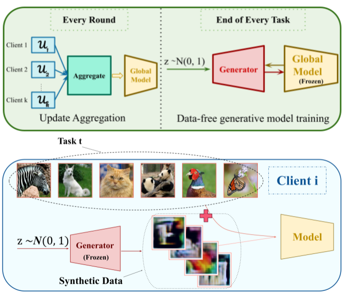

## A Data-Free Approach to Mitigate Catastrophic Forgetting in Federated Class Incremental Learning for Vision Tasks
PyTorch code for NeurIPS'23 paper:\
**A Data-Free Approach to Mitigate Catastrophic Forgetting in Federated Class Incremental Learning for Vision Tasks**\
**_[Sara Babakniya]_**, Zalan Fabian, Chaoyang He, Mahdi Soltanolkotabi, Salman Avestimehr\
Advances in Neural Information Processing Systems 36, 2023\
[[pdf]]

<p align="center">

</p>

## Abstract
Deep learning models often suffer from forgetting previously learned information when trained on new data. This problem is exacerbated in federated learning (FL), where the data is distributed and can change independently for each user. Many solutions are proposed to resolve this catastrophic forgetting in a centralized setting. However, they do not apply directly to FL because of its unique complexities, such as privacy concerns and resource limitations. To overcome these challenges, this paper presents a framework for federated class incremental learning that utilizes a generative model to synthesize samples from past distributions. This data can be later exploited alongside the training data to mitigate catastrophic forgetting. To preserve privacy, the generative model is trained on the server using data-free methods at the end of each task without requesting data from clients. Moreover, our solution does not demand the users to store old data or models, which gives them the freedom to join/leave the training at any time. Additionally, we introduce SuperImageNet, a new regrouping of the ImageNet dataset specifically tailored for federated continual learning. We demonstrate significant improvements compared to existing baselines through extensive experiments on multiple datasets.

## Installation

### Prerequisite
* python == 3.9
* torch == 1.13.1
* torchvision == 0.14.1

### Dataset
 * Download the datasets (CIFAR-100, TINY_IMAGENET, IMAGENET) and set the directory in --path. 


# Run Code

<div>
  <button class="copy-button" onclick="copyToClipboard('code-to-copy')"></button>
  <pre><code id="code-to-copy">python main.py --dataset=CIFAR100 --method=MFCL --num_clients=50 --path={PATH_TO_CIFAR10}</code></pre>
</div>


# Contact
Please contact Sara Babakniya (babakniy@usc.edu) if you have any questions.

# Citation
If you find our code or work useful, please cite our paper:
```
@inproceedings{
babakniya2023a,
title={A Data-Free Approach to Mitigate Catastrophic Forgetting in Federated Class Incremental Learning for Vision Tasks},
author={Sara Babakniya and Zalan Fabian and Chaoyang He and Mahdi Soltanolkotabi and Salman Avestimehr},
booktitle={Thirty-seventh Conference on Neural Information Processing Systems},
year={2023},
url={https://openreview.net/forum?id=3b9sqxCW1x}
}
```
[Sara Babakniya]: https://sarababakn.github.io/
[pdf]: https://openreview.net/pdf?id=3b9sqxCW1x